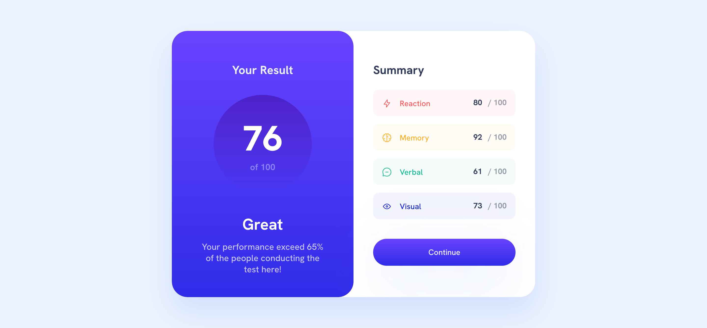

# Frontend Mentor - Results summary component solution

This is a solution to the [Results summary component challenge on Frontend Mentor](https://www.frontendmentor.io/challenges/results-summary-component-CE_K6s0maV). Frontend Mentor challenges help you improve your coding skills by building realistic projects.

## Table of contents

- [Overview](#overview)
  - [The challenge](#the-challenge)
  - [Screenshot](#screenshot)
  - [Links](#links)
- [My process](#my-process)
  - [Built with](#built-with)
  - [What I learned](#what-i-learned)
  - [Continued development](#continued-development)
  - [Useful resources](#useful-resources)
- [Author](#author)
- [Acknowledgments](#acknowledgments)

### The challenge

Users should be able to:

- View the optimal layout for the interface depending on their device's screen size
- See hover and focus states for all interactive elements on the page

### Screenshot

### Links

- Solution URL: [Add solution URL here](https://github.com/kajahaler712/results-summary-component)
- Live Site URL: [Add live site URL here](https://kajahaler712.github.io/results-summary-component/index.html)

### Built with

- Semantic HTML5 markup
- CSS (SASS)
- CSS Grid
- Mobile-first workflow

### What I learned

CSS Grid for Mobile-first approach.

## Author

- Kaja Haler
- Frontend Mentor - [@kajahaler712](https://www.frontendmentor.io/profile/kajahaler712)
